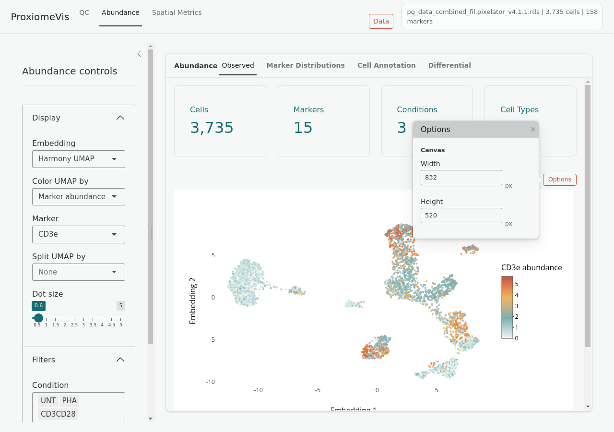
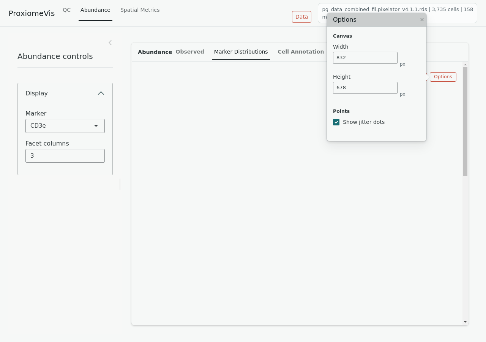

# Abundance

Use the Abundance tab to inspect marker expression, marker distributions,
cell-type composition, annotation summaries, and differential abundance.

## Observed

The **Observed** view projects cells onto the selected embedding and colors them
by marker abundance, cell type, condition, or other available metadata.

Open **Options** next to the plot to adjust canvas width, canvas height, and dot
size.

## Marker Distributions

The **Marker Distributions** view compares marker abundance across conditions,
samples, or cell types. Use sidebar controls for marker selection, grouping, and
facet columns.

Open **Options** next to the plot to adjust canvas width, canvas height, dot
size, and jitter dot visibility.

## Cell Annotation

The **Cell Annotation** view summarizes cell-type composition and annotation
patterns. Use it to check whether expected cell populations are present across
conditions and samples.

## Differential

The **Differential** view compares two groups. Select group A, group B
reference, cell-type filters, thresholds, and marker detail. The volcano and
detail plots are shown side by side.

Differential results depend on the selected contrast and minimum cell count.
If no points pass thresholds, lower the effect threshold or verify that both
groups contain enough cells.
