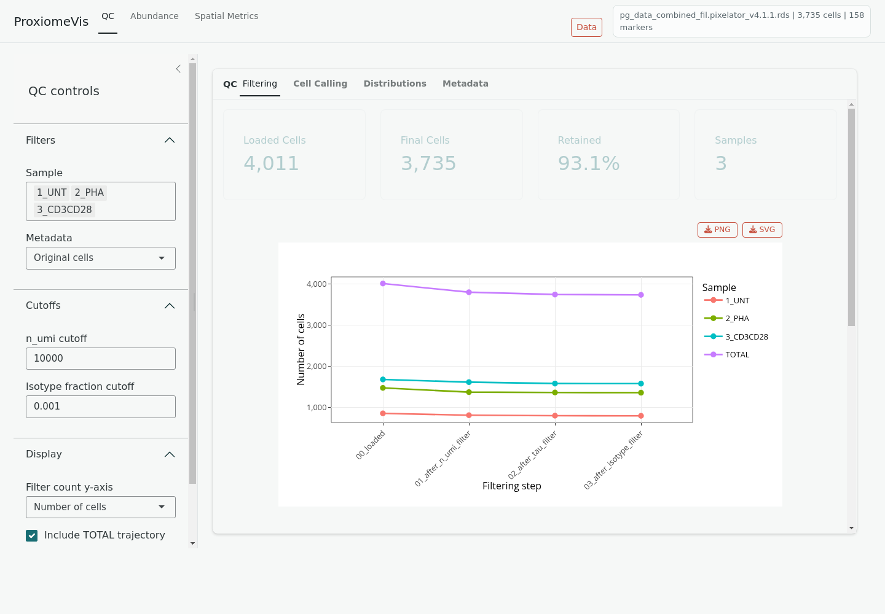

# ProxiomeVis

ProxiomeVis is an interactive Shiny application for exploring Pixelator-derived
single-cell protein data. It is designed for reviewing QC, marker abundance,
cell annotation, differential readouts, marker self-clustering, marker-pair
colocalization, and selected Pixelator graph layouts.

## What the app shows

- **QC**: filtering summaries, cell-calling rank plots, QC metric distributions,
  and original metadata.
- **Abundance**: marker abundance on embeddings, marker distributions, cell-type
  composition, annotation heatmaps, and differential abundance.
- **Spatial Metrics**: clustering and colocalization readouts from stored
  Pixelator proximity outputs, plus an interactive 3D layout view when
  `.layout.pxl` files are available.

The app reads values already stored in the loaded Pixelator-compatible RDS file.
It does not rerun expensive Pixelator proximity calculations during app use.

## Typical workflow

1. Open the app.
2. Load the demo data or enter a readable RDS path.
3. Review QC first.
4. Explore abundance and annotation.
5. Use Spatial Metrics for clustering, colocalization, heatmaps, differential
   comparisons, and 3D layouts.
6. Adjust plot Options and download figures where download buttons are available.
